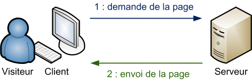
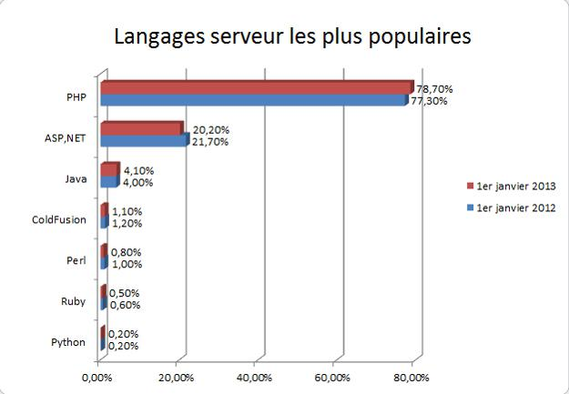

# Introduction au développement Web

L'objectif de ce chapitre est de découvrir les notions fondamentales liées au développement Web.

I> Ce chapitre s'inspire de la [documentation du framework PHP Symfony](http://symfony.com/doc/current/book/from_flat_php_to_symfony2.html).

## Le fonctionnement du Web

Pour consulter un site Web sur Internet, il suffit de taper l'adresse correcte du site dans la barre d'adresse d'un navigateur Web, et le site s'affiche (si l'accès au réseau fonctionne). Nous allons tenter de comprendre ce qui se cache derrière cette opération très simple en apparence. 

### La notion de serveur Web

Pour être accessible, un site Web doit être publié sur un serveur. 

Un **serveur** est un ype particulier d'ordinateur dont le rôle est d'attendre les demandes de clients, et d'y répondre. Un serveur rend un service à ses clients.

Il existe de nombreux types de serveurs, en fonction du service rendu : serveur de fichiers, de messagerie, d'authentification... Un serveur qui permet de publier des sites Web est appelé serveur Web. 

I> Une même machine peut rendre différents services (exemple : serveur Web et serveur de fichiers).

Plus précisément, une machine serveur Web embarque et exécute un logiciel serveur, capable de répondre aux demandes de consultations de sites Web. Les logiciels serveurs Web les plus populaires sont [Apache](http://httpd.apache.org/), [Microsoft IIS](http://www.iis.net/) et [nginx](http://nginx.org/).

### La notion de client Web

La machine qui permet la consultation du site Web demandé est appelé **client Web**. Il s'agit d'un abus de langage : en réalité, le véritable client est un logiciel qui s'exécute sur cette machine et réalise l'opération de consultation. Ce logiciel est le plus souvent un navigateur Web (*browser*). Les navigateurs Web les plus populaires sont [Internet Explorer](http://windows.microsoft.com/fr-fr/internet-explorer/), [Mozilla Firefox](https://www.mozilla.org/fr/firefox), [Chrome](https://www.google.fr/chrome/browser/), [Safari](https://www.apple.com/fr/safari/) et [Opera](http://www.opera.com/fr).

D'autres types de logiciels que les navigateurs peuvent jouer le rôle de clients Web en se connectant à des serveurs Web. Exemples : robots d'indexation, aspirateurs Web, applications mobiles, etc.

### La communication entre client et serveur

La compréhension des échanges ayant lieu entre un client et un serveur Web lors de la consultation d'un site est essentielle. Il s'agit d'un mécanisme de type **requête/réponse**.

1. L'échange est initié par le client, qui envoie au serveur une requête pour consulter une ressource Web.
2. Le serveur prépare la page HTML associée.
3. Le serveur renvoie la page HTML au client, qui l'affiche.

Afin de se comprendre, client et serveur Web utilisent pendant leurs échanges un protocole commun : HTTP.

## Le protocole HTTP

HTTP (*HyperText Transfert Protocol*) est le protocole de transfert du Web. C'est son invention en 1989 au CERN de Genève, en même temps que le langage HTML, qui a conduit à l'apparition du World Wide Web : un immense réseau de réseaux, où on peut "rebondir" d'une page Web à une autre en utilisant des liens sans avoir besoin de connaître l'emplacement physique des serveurs et des ressources consultés.

HTTP est fondamentalement un protocole très simple, basé sur des commandes textuelles.

### Anatomie d'une requête HTTP

Prenons comme exemple la première étape de l'échange décrit plus haut.

La requête HTTP envoyée par le navigateur prend une forme similaire à celle-ci :

    GET / HTTP/1.1
    Host: xkcd.com
    Accept: text/html
    User-Agent: Mozilla/5.0 (Macintosh)

La première ligne de cette requête HTTP est la plus importante. Elle contient :

* La **méthode** associée à la requête : ici, `GET` signifie une demande de ressource.
* L'identifiant de la **ressource concernée**. Ici, `/` (symbole de la racine, comme sous Linux) indique qu'on souhaite accéder au document par défaut.
* La **version** du protocole HTTP, ici 1.1.

Les autres lignes de la requête HTTP sont appelés champs d'en-tête (*HTTP header fields* ou plus simplement *headers*). Ils précisent le site Web concerné (champ `Host`), les types de contenu acceptés par le client (champ `Accept`) et le logiciel client utilisé (champ `User-Agent`). Il existe d'autres champs d'en-tête, non présentés ici.

Les méthodes HTTP les plus fréquemment utilisées sont `GET` (pour récupérer une ressource depuis le serveur) et `POST` (pour modifier une ressource sur le serveur). Il en existe d'autres comme `HEAD`, `PUT` ou `DELETE`.

### Anatomie d'une réponse HTTP

Lorsqu'il reçoit une requête HTTP, le serveur Web y puise les informations nécessaires pour construire la réponse, puis la renvoie au client. Continuons avec notre exemple précédent.

La réponse HTTP renvoyée du serveur au client prend l'aspect ci-dessous.

    HTTP/1.1 200 OK
    Date: Mon, 14 Apr 2013 14:05:05 GMT
    Server: lighttpd/1.4.19
    Content-Type: text/html

    <html>
        <!-- code HTML de la page -->
        <!-- ... -->
    </html>

La première ligne de la réponse contient son **statut** sous la forme d'un code qui indique le résultat de la requête. Comme une requête, une réponse HTTP contient des champs d'en-tête (`Date`, `Content-Type` et bien d'autres) permettant de véhiculer des informations additionnelles. Par exemple, il est possible d'utiliser certains champs pour mettre en place un mécanisme de cache.

Enfin, la réponse HTTP contient éventuellement la ressource demandée par le client. Le plus souvent, il s'agit d'une page Web décrite sous la forme de balises HTML. 

### Les codes HTTP

Les codes de retour HTTP peuvent être classés par familles en fonction du premier chiffre.

| Famille | Signification               | Exemples                                  |
|---------|-----------------------------|-------------------------------------------|
| **1xx** | Information                 |                                           |
| **2xx** | Succès                      | 200 : requête traitée avec succès         |
| **3xx** | Redirection                 |                                           |
| **4xx** | Erreur provenant du client  | 400 : syntaxe de la requête erronée       |
|         |                             | 404 : ressource demandée non trouvée      |
| **5xx** | Erreur provenant du serveur | 500 : erreur interne du serveur           |
|         |                             | 503 : service temporairement indisponible |

Vous trouverez sur [Wikipedia](http://fr.wikipedia.org/wiki/Hypertext_Transfer_Protocol) plus de détails sur le protocole HTTP.

### La notion d'URL

On a l'habitude d'accéder à un site Web en utilisant son adresse. Celle-ci est de la forme :
http://www.monsite.fr/mondossier/mapage.html. On peut décomposer cette adresse en plusieurs sous-parties.

* `http://` signifie qu'on utilise le protocole HTTP.
* `www.monsite.fr` est le nom de domaine du site Web visité.
* `/mondossier/mapage.html` est le chemin de la ressource demandée au sein du site.

La majorité des serveurs Web est configurée pour renvoyer une page par défaut (`index.html`, `index.php`, `Default.aspx`) lorsque le client ne précise pas explicitement quelle page il souhaite récupérer (exemples : http://www.monsite.fr ou http://www.monsite.fr/mondossier/).

Une adresse Web telle que celle ci-dessus esr ce qu'on appelle une **URL** ou *Uniform Resource Locator*. Elle permet de décrire l'emplacement d'une ressource Web et le moyen d'y accéder.

## La place du langage PHP

Les évolutions technologiques récentes ont rendu la frontière entre sites statiques et dynamiques de plus en plus floue. Ce paragraphe présente ces deux concepts de manière générale.

### Anatomie d'un site Web statique

Un site Web statique se compose essentiellement de fichiers sources **HTML** (pour le contenu des pages) et **CSS** (pour la mise en forme). Il peut également intégrer d'autres types de ressources comme par exemple des images.

La consultation d'un site Web statique met en jeu deux logiciels :

* Le logiciel client, le plus souvent un navigateur Web.
* Le logiciel serveur Web.

Lorsqu'un client envoie une requête au serveur Web hébergeant un site statique, le serveur se contente de la renvoyer la ressource demandée. Les pages HTML affichées ne peuvent pas évoluer automatiquement, d'où le terme "statique".

{:.centered}

L'accès à un site Web statique est un exemple d'architecture **client/serveur**, appelée également architecture **deux tiers**.

Tier

: Un "tier" correspond à un processus (programme en cours d'exécution) impliqué dans l'utilisation d'une application informatique.

La mise à jour d'un site Web statique nécessite l'édition des fichiers sources, puis la mise en ligne des modifications (publication sur le serveur Web). Ce processus a plusieurs inconvénients :

* Il nécessite des connaissances techniques : langages HTML et/ou CSS, méthode de publication d'un site, etc.
* Il devient vite contraignant dans le cas d'un site qui change fréquemment.
* Il est inadapté aux sites dont le contenu est enrichi par ses utilisateurs ("Web 2.0").

Pour toutes les raisons précédentes, on emploie un site statique lorsque le seul besoin est de présenter des informations au visiteur, sans aucune interactivité. On parle également de site vitrine.

### Anatomie d'un site Web dynamique

A l'inverse d'un site statique, un site dynamique est un type de site Web dans lequel le contenu des pages peut évoluer automatiquement. 

Lorsqu'un client envoie une requête au serveur Web hébergeant un site dynamique, le serveur prépare la page HTML correspondant à cette requête, puis la renvoie au client pour affichage. Les pages Web affichées au visiteur ne sont pas codées "en dur" comme dans le cas d'un site statique, mais **générées** au moment de leur consultation.

{:.centered}

Les pages HTML obtenues peuvent être personnalisées en fonction du visiteur et/ou de données externes au site. Un cas très fréquent est celui où les pages Web renvoyées incluent des informations stockées dans une base de données. On obtient alors un exemple d'architecture **trois tiers**.

{:.centered}

**ATTENTION** : il est très important de comprendre que le résultat renvoyé par le serveur Web et affiché par le client est toujours une page HTML.

Contrairement à un site statique, un site dynamique ouvre la voie à des interactions quasiment illimitées avec ses visiteurs : identification, échange de données entre site et utilisateur, mise à jour du site par ses utilisateurs... Plus besoin de mettre à jour manuellement le code source des pages du site : il suffit que les données nécessaires soient stockées et accessibles par le serveur Web pour construire la page HTML affichée. Voici quelques types de sites Web dynamiques : sites de e-commerce, CMS, wikis, forums...

Un site Web dynamique se compose de pages HTML, de fichiers CSS et d'autres ressources comme des images, mais pas seulement. Il emploie nécessairement un langage capable de générer des pages HTML.

### Les langages serveur du Web dynamique

Lorsqu'on souhaite créer soi-même un site Web dynamique, on doit commencer par choisir le langage utilisé pour la génération des pages HTML. Le diagramme ci-dessous rassemble les principaux acteurs de ce marché.

{:.centered}

On constate que la technologie la plus populaire est PHP, suivie de loin par ASP.NET (Microsoft) et Java (ORACLE). PHP est particulièrement dominant dans le secteur des CMS (*Content Management System*) qui permettent de publier du contenu en ligne sans presque aucune connaissance technique. On peut citer comme exemples Wordpress, Drupal ou Joomla.

Quelle que soit la technologie mise en oeuvre, il est essentiel de bien comprendre que ces langages sont toujours employés côté serveur et jamais côté client (d'où le terme de langages "serveur") Un navigateur Web ne sait pas exploiter directement une page PHP ou ASP.NET. En revanche, il sait afficher une page HTML qu'un serveur Web aura préalablement générée en utilisant PHP ou ASP.NET.

{:.centered}
