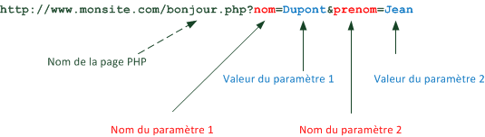

# Transmettre des données entre pages

L'objectif de ce chapitre est de connaître les différents moyens de faire passer des informations d'une page PHP à l'autre, ce qui est un besoin fréquent lorsqu'on crée un site Web.

## Transmission via l'URL

Une URL représente l'adresse d'une page web et commence par `http://` ou `https://`. Lorsqu'on fait un lien vers une autre page, il est possible d'ajouter des paramètres sous la forme `bonjour.php?nom=Dupont&prenom=Jean` qui seront transmis à la page.



On peut transmettre autant de paramètres que l'on veut dans une URL, la seule limite étant de ne pas dépasser une longueur totoale de 256 caractères.

Dans ce cas, la page `bonjour.php` recevra ces paramètres dans un tableau associatif nommé `$_GET` et défini automatiquement par PHP :

* `$_GET['nom']` aura pour valeur `Dupont` ;
* `$_GET['prenom']` aura pour valeur `Jean`.

Avant d'utiliser un paramètre transmis dans l'URL, on doit utiliser la fonction `isset` qui permet de vérifier si ce paramètre est défini ou non.

```php
if (isset($_GET['nom']) {
    // Utilisation de $_GET['nom']
    // ...
})
```

Si un paramètre provenant de l'URL est destiné à être affiché dans la page HTML générée par PHP (exemple : `<?php echo $_GET['nom']; ?>`), il faut également prendre une précaution supplémentaire pour éviter certaines failles de sécurité (voir plus bas).

## Transmission via un formulaire

Les formulaires sont le moyen le plus pratique pour le visiteur de transmettre des informations à un site. PHP est capable de récupérer les données saisies par vos visiteurs et de les traiter. 

### Création d'un formulaire

On ajoute un formulaire à une page Web grâce à la balise HTML `<form>`.

```html
<!doctype html>
<html>
    <head>
        <title>Mon premier formulaire</title>
        <meta charset="UTF-8" />
    </head>
    <body>
         <form action="login.php" method="post"> 
            <p>Entrez votre login :
                <input type="text" name="login" size="20" required /></p>
            <p>Entrez votre mot de passe :
                <input type="password" name="password" size="20" required /></p>
            <input type="submit" value="Envoyer" />
         </form>
    </body>
</html>
```

La balise HTML `<form>` possède deux attributs importants :

* `action` permet de définir l'URL qui traitera les informations soumises par le formulaire, lorsque l'utilisateur le validera en cliquant sur le bouton de type `submit` (ici "Envoyer").
* `method` permet de définir le type de requête HTTP utilisée pour envoyer les données à l'URL d'action. Ici, ce sera une requête `POST`, le cas le plus fréquent avec les formulaires.

**Note** : on peut également utiliser la méthode `GET` avec un formulaire, mais dans ce cas les paramètres seront visibles dans l'URL et on court le risque de dépasser la taille maximale de 256 caractères.

A l'intérieur d'un formulaire, les balises HTML `<input>` permettent de définir des champs de saisie pour l'utilisateur. L'attribut `name` d'une balise `<input>` définit le nom de la variable qui contiendra la valeur saisie.

### Récupération des données d'un formulaire

Lorsque l'utilisateur soumet un formulaire, la ressource identifiée par l'attribut `action` de la balise `<form>` reçoit les données du formulaire et peut les traiter.

Si le formulaire est soumis avec la méthode `POST`, les données envoyées via un formulaire sont ajoutées dans le corps de la requête HTTP et se retrouvent dans un tableau associatif nommé `$_POST` défini automatiquement par PHP.

Comme toutes les variables superglobales, `$_POST` s'utilise comme un tableau associatif :

* Les clés de ce tableau sont les noms des champs du formulaire (attributs `name` des balises `<input>` du formulaire).
* Les valeurs associées aux clés sont les données saisies par l'utilisateur dans chaque champ.

```php
// récupération des zones de saisie dans des variables
$login = $_POST["login"];
$mdp = $_POST["password"];
// ...
```

A des fins de débogage, on peut afficher le contenu de `$_POST` en ajoutant une instruction `print_r($_POST)`.

### Types de champs de saisie

L'attribut `type` d'une balise `<input>` permet de préciser le type de donnée à saisir et est interprétée par le navigateur pour améliorer l'expérience utilisateur.

* Pour faire saisir un texte court (une seule ligne), on utilise une balise `<input type="text" ...>`. On peut définir la valeur initiale du champ en ajout l'attribut `value`.

~~~html
<input type="text" name="prenom" value="Baptiste" />
~~~

* Pour faire saisir un mot de passe, on utilise une balise `<input type="password" ...>`. Dans ce cas, le navigateur masque les caractères saisis par l'utilisateur.

~~~html
<input type="password" name="mdp" />
~~~

* Pour faire saisir un texte plus long (plusieurs lignes), on utilise une balise `<textarea>`. La balise fermante `</textarea>` est obligatoire et l'éventuelle valeur initiale est ajoutée entre les balises ouvrante et fermante. L'attribut `rows` est utilisé pour préciser le nombre le lignes de la zone de saisie.

~~~html
<textarea name="message" rows="6">Entrez votre message</textarea>
~~~

* Pour faire saisir une valeur binaire (oui/non, vrai/faux, etc), on utilise une balise `<input type="checkbox" ...>`. L'attribut `checked`, s'il est présent, précise que la case est cochée par défaut.

~~~html
<input type="checkbox" name="familier" checked />
~~~

Lors de la récupération des données du formulaire, on vérifie l'état de la case (cochée ou non) à l'aide de la fonction `isset`.

~~~php
if (isset($_POST["familier"])) {
    // La case est cochée
else {
    // La case est décochée
}
~~~

* Pour faire saisir un choix parmi plusieurs, on utilise des balises `<input type="radio" ...>` ayant la même valeur pour l'attribut `name`. On crée ainsi une série de boutons radios dont seul l'un pourra être coché par l'utilisateur. 

~~~html
<input type="radio" name="politesse" value="1" checked /> Mademoiselle<br />
<input type="radio" name="politesse" value="2" /> Madame<br />
<input type="radio" name="politesse" value="3" /> Monsieur<br />
~~~

Lors de la récupération des données du formulaire, on examine la valeur du champ afin d'en déduire la case cochée. Cette valeur correspond à l'attribut `value` du bouton sélectionné.

~~~php
$message = "Bonjour, ";
switch($_POST["politesse"]) 
{
case 1:
    $message = $message . " Mademoiselle.";
    break;
case 2:
    $message = $message . " Madame.";
    break;
case 3:
    $message = $message . " Monsieur.";
    break;
}
~~~

* Une autre possibilité pour faire saisir un choix parmi plusieurs est de définir une liste déroulante grâce à une balise `<select>`. A l'intérieur de cette balise, on ajoute des choix possibles grâce à la balise <option>.

~~~html
<select name="catpro" size="1">
    <option value="CP1" selected> Etudiant</option>
    <option value="CP2"> Salarié</option>
    <option value="CP3"> Cadre</option>
</select>
~~~

L'attribut `size` de la balise `<select>`` définit le nombre d'éléments affichés par la liste. L'élément sélectionné par défaut est indiqué par l'attribut `selected`.

Lors de la récupération des données du formulaire, on examine la valeur du champ pour trouver l'élément qui a été sélectionné. Cette valeur correspond à l'attribut `value` de l'élément choisi.

~~~php
$codecat = $_POST["catpro"]; 
if ($codecat == "CP1") $categorie = "Etudiant";
elseif ($codecat == "CP2") $categorie = "Salarié";
elseif ($codecat == "CP3") $categorie = "Cadre";
~~~

#### Autres types de champs

    * `<input type="email" ...>` : saisie d'une adresse de courriel.
    * `<input type="number" ...>` : saisie d'un nombre.
    * `<input type="date" ...>` : saisie d'une date.
    * ... ([liste des types de champ](https://developer.mozilla.org/fr/docs/Web/HTML/Element/Input)).

#### Amélioration de l'expérience utilisateur

Deux attributs des balises de saisie permettent d'aider l'utilisateur du formulaire dans sa saisie :

* `autofocus` (booléen) place le curseur de saisie sur le champ au chargement du formulaire.
* `placeholder` définit le contenu par défaut du champ.

La norme HTML5 a apporté de nouveaux types de champs comme `email`, `number` ou `date`. En voici la [liste complète](https://developer.mozilla.org/fr/docs/Web/HTML/Element/Input).

~~~html
<input type="email" name="courriel" />
~~~

Les navigateurs modernes interprètent ce type pour :

* Améliorer l'expérience de saisie (exemple : un calendrier déroulant pour un champ de type `date`).
* Valider la saisie avant envoi de la requête au serveur (exemple : vérification de la présence d'un `@` pour un champ de type `email`). 

Il est également possible de rendre un champ obligatoire grâce à l'attribut booléen `required`.

~~~html
<input type="email" name="courriel" required />
~~~

Malgré tout, la validation finale des valeurs saisies dans un formulaire doit toujours se faire côté serveur (par exemple avec PHP) pour des raisons de sécurité.

### Envoi de fichiers avec un formulaire

Les formulaires permettent également d'envoyer des fichiers. On retrouve les informations sur les fichiers envoyés dans un tableau associatif nommé `$_FILES`.

TODO

## Transmission de données et sécurité

Que ce soit pour des données issues de l'URL (`$_GET`) ou d'un formulaire (`$_POST`), il garder à l'esprit que les données reçues sont saisies par l'utilisateur, ce qui peut constituer une menace pour la sécurité du site. Par défaut, rien n'empêche un utilisateur malveillant de saisir des données de manière à provoquer un comportement inattendu du site Web. C'est ce que l'on appelle **l'injection de code**, ou faille XSS. Par exemple, au lieu de saisir son nom, l'utilisateur va saisir un morceau de code JavaScript qui s'exécutera à l'insu du développeur du site.

```html
<script type="text/javascript">alert('Miaou !')</script>
```

Pour se prémunir contre ces risques, il faut appliquer un principe très important : **ne jamais faire confiance aux données de l'utilisateur**. Un développeur Web qui suppose que ses utilisateurs saisiront uniquement des informations appropriées et n'effectue aucun contrôle sur ces saisies prend le risque d'exposer son site à des attaques très faciles à réaliser.

Un premier niveau de sécurité, qui doit devenir un réflexe, consiste à toujours vérifier le contenu des tableaux `$_GET` et `$_POST` reçus avant de les insérer dans une page HTML. Il existe plusieurs fonctions PHP qui limitent fortement le risque d'injection de code. Le choix le plus fréquent est la fonction `htmlspecialchars`. Cette fonction remplace les éventuelles balises HTML présentes dans la valeur qu'elle reçoit. On peut intégrer l'appel à `htmlspecialchars` dans une fonction `escape`.

```php
<?php

/**
 * Nettoie une valeur insérée dans une page HTML
 * Doit être utilisée à chaque insertion de données dynamique dans une page HTML
 * Permet d'éviter les problèmes d'exécution de code indésirable (XSS)
 * @param string $valeur Valeur à nettoyer
 * @return string Valeur nettoyée
 */
function escape($valeur)
{
    // Convertit les caractères spéciaux en entités HTML
    return htmlspecialchars($valeur, ENT_QUOTES, 'UTF-8', false);
}
?>
```

Il faut penser à toujours utiliser cette fonction lors de l'insertion de données externes dans une page Web.

```php
$prenom = $_GET["prenom"];
$nom = $_GET["nom"];
echo 'Bienvenue ' . escape($prenom) . ' ' .escape($nom) . ' !';
```

## Notion de variable superglobale

Les variables `$_GET` et `$_POST` sont des exemples de variables superglobales. Une variable superglobale est une variable PHP particulière créée par le langage et non par le développeur. La plupart du temps, elle commence par le symbole `$_`. Elle a comme autre particularité d'être disponible partout dans le code (d'où son nom). On peut par exemple accéder au contenu de `$_POST` depuis n'importe quel endroit d'une page PHP. Une variable superglobale est un tableau associatif qui permet d'associer des clés et des valeurs.

## Transmission via la session

La variable superglobale `$_SESSION` permet de stocker des informations qui seront automatiquement transmises de page en page pendant toute la durée de visite d'un internaute sur une site.

### Création d'une session

La création d'une nouvelle session s'effectue en appelant la fonction `session_start`.

```php
session_start();
// ...
```

**Attention** : cette fonction doit obligatoirement être appelée au tout début de la page, avant tout code HTML.

### Définition de variables de session

Une fois la session créée, on peut y ajouter de nouvelles variables identifiées par leur nom.

```php
$_SESSION['prenom'] = 'Baptiste';
$_SESSION['age'] = 39;
```

### Utilisation de variables de session

Dans n'importe quelle page où la fonction `session_start` a été appelée, on peut utiliser `$_SESSION` pour accéder aux valeurs des variables de session. Il est prudent de vérifier au préalable que la variable existe, grâce à la fonction `isset`.

```php
if (isset($_SESSION['prenom']) && isset($_SESSION['age'])) {
    echo 'Je te connais toujours ! Tu es ' . $_SESSION['prenom'] . 
        ' et tu as ' . $_SESSION['age'] . ' ans.';
}
else {
    echo "Je ne te connais pas...";
}
```

### Destruction d'une session

En fin de visite, la destruction explicite d'une session se fait grâce à la fonction `session_destroy`. Après l'appel, la variable `$_SESSION` n'est plus utilisable.

**Rappel** : cette destruction est automatique au bout d'un certain temps d'inactivité.

### Intérêt des sessions

Un cas d'utilisation très fréquent des sessions est l'authentification d'un utilisateur par login/mot de passe. En utilisant une session pour mémoriser ces paramètres, on peut "reconnaître" l'utilisateur sur toutes les pages du site, mais aussi restreindre certaines zones aux utilisateurs authentifiés : si la variable de session associée au login existe, on affiche le contenu, sinon on affiche une erreur.
