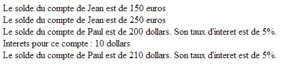

# La programmation orientée objet en PHP

Le langage PHP permet d'utiliser la programmation orientée objet, avec toutefois quelques spécificités par rapport à d'autres langages comme Java ou C#. Nous allons faire un rapide tour d'horizon des possibilités de PHP en matière de POO au travers de l'exemple classique des comptes bancaires.

## Exemple de mise en oeuvre

Voici la définition PHP d'une classe `CompteBancaire`.

~~~php
<?php

class CompteBancaire
{
    private $devise;
    private $solde;
    private $titulaire;

    public function __construct($devise, $solde, $titulaire)
    {
        $this->devise = $devise;
        $this->solde = $solde;
        $this->titulaire = $titulaire;
    }

    public function getDevise()
    {
        return $this->devise;
    }
    
    public function getSolde()
    {
        return $this->solde;
    }
    
    protected function setSolde($solde)
    {
        $this->solde = $solde;
    }
    
    public function getTitulaire()
    {
        return $this->titulaire;
    }
    
    public function crediter($montant) {
        $this->solde += $montant;
    }

    public function __toString()
    {
        return "Le solde du compte de $this->titulaire est de " . $this->solde . " " . $this->devise;
    }
}
?>
~~~

En complément, voici la définition d'une classe `CompteEpargne` qui hérite de la classe `CompteBancaire`.

~~~php
<?php

require_once 'CompteBancaire.php';

class CompteEpargne extends CompteBancaire
{
    private $tauxInteret;
    
    public function __construct($devise, $solde, $titulaire, $tauxInteret)
    {
        parent::__construct($devise, $solde, $titulaire);
        $this->tauxInteret = $tauxInteret;
    }
    
    public function getTauxInteret()
    {
        return $this->tauxInteret;
    }
    
    public function calculerInterets($ajouterAuSolde = false)
    {
        $interets = $this->getSolde() * $this->tauxInteret;
        if ($ajouterAuSolde == true)
            $this->setSolde($this->getSolde() + $interets);
        return $interets;
    }
    
    public function __toString()
    {
        return parent::__toString() . 
        '. Son taux d\'interet est de ' . $this->tauxInteret * 100 . '%.';
    }
}
?>
~~~

**Note** : l'instruction [require_once](http://php.net/manual/fr/function.require-once.php) est similaire à [require](http://php.net/manual/fr/function.require.php) mais n'inclut le fichier demandé qu'une seule fois. Elle est utile pour éviter, comme ici, les définitions multiples de classes.

Voici un exemple d'utilisation de ces deux classes.

~~~php
<?php

require 'CompteBancaire.php';
require 'CompteEpargne.php';

$compteJean = new CompteBancaire("euros", 150, "Jean");
echo $compteJean . ' ';
$compteJean->crediter(100);
echo $compteJean . ' ';

$comptePaul = new CompteEpargne("dollars", 200, "Paul", 0.05);
echo $comptePaul . ' ';
echo 'Interets pour ce compte : ' . $comptePaul->calculerInterets() . 
' ' . $comptePaul->getDevise() . ' ';
$comptePaul->calculerInterets(true);
echo $comptePaul . ' ';
?>
~~~

Enfin, voici le résultat de son exécution.

## Caractéristiques du modèle objet de PHP

L'observation des exemples précédents nous permet de retrouver certains concepts bien connus de la POO, repris par PHP :

* une **classe** se compose d'**attributs** et de **méthodes** ;
* le mot-clé `class` permet de définir une classe ;
* les différents niveaux d'accessibilité sont `public`, `protected` et `private` ;
* le mot-clé `extends` permet de définir une classe dérivée (comme en Java) ;
* le mot-clé `$this` permet d'accéder aux membres de l'objet courant.

## Spécificités du modèle objet de PHP

Même s'il est similaire à ceux de C#, Java ou C++, le modèle objet de PHP possède certaines particularités :

* PHP étant un langage à typage dynamique, on ne précise pas les types des attributs et des méthodes, mais seulement leur niveau d'accessibilité ;
* le mot-clé `function` permet de déclarer une méthode, quelle que soit son type de retour ;
* le mot-clé `parent` permet d'accéder au parent de l'objet courant. Il joue en PHP le même rôle que `base` en C# et `super` en Java ;
* le constructeur d'une classe s'écrit `__construct` ;
* la méthode `__toString` détermine comment l'objet est affiché en tant que chaîne de caractères ;
* on peut redéfinir (*override*) une méthode, comme ici `__toString`, sans mot-clé particulier ;
* il est possible de définir une valeur par défaut pour les paramètres d'une méthode. Elle est utilisée lorsque l'argument (paramètre effectif) n'est pas précisé au moment de l'appel.
Remarques :

**Attention** : l'utilisation de `$this->` est **obligatoire** pour accéder aux membres de l'objet courant. Son utilisation est optionnelle en C# et en Java, et souvent limitée à la levée des ambiguïtés entre attributs et paramètres.

**Note** : les méthodes `__construct` et `__toString` font partie de ce qu'on appelle les [méthodes magiques PHP](http://php.net/manual/fr/language.oop5.magic.php).

